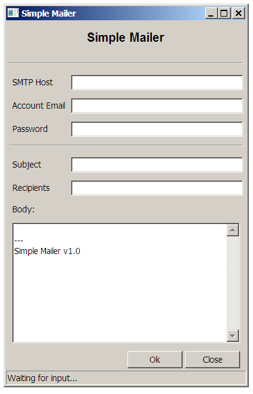
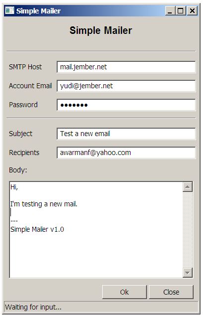
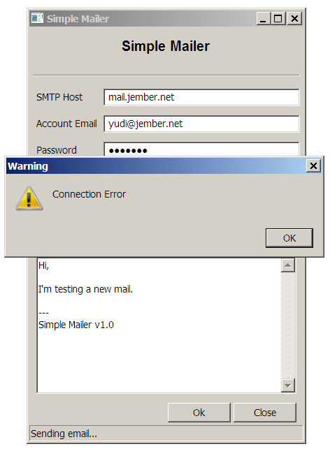

# Simple Mailer - 1

This is my first application. It's very simple.

Features

- No SSL or TSL. Email is sent by unsecure link. This email is not encrypted, its contents are transmitted as plain, readable text. 
- Support SMTP Auth
- Sent email to smtp host using port default (25)
- Version 1.0

Test the application only on your LAN.

There's a method to check all entries must be filled before send the email or pressing the OK button.

## Screenshots

You will get an error if trying to send email with unsecure link or your Internet Service Provider.

