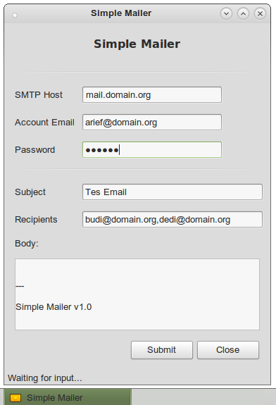
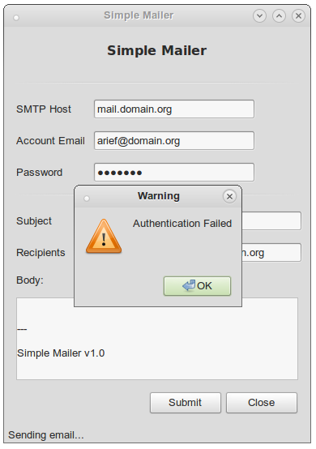
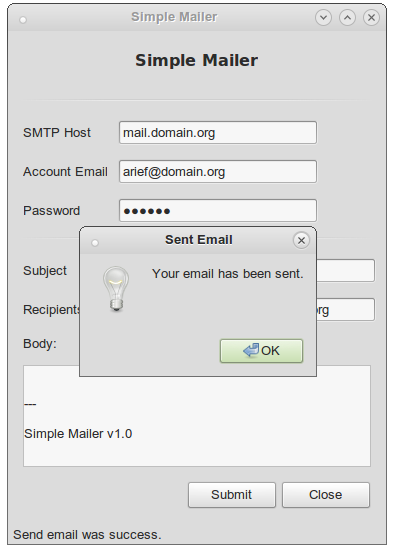
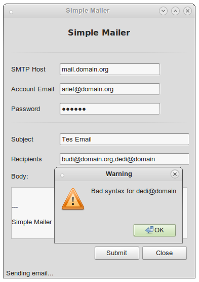

# Simple Mailer - 2

Still very simple.

Features

- A regex to check the email validity
- Adding icon which shown at the top left of the application
- Support more than one recipients (separated by comma)
- Version 1.0

Include all features from the previuos stage.

Test the application only on your LAN.

Icon archive [Email Icon](http://www.iconarchive.com/show/soft-scraps-icons-by-hopstarter/Email-icon.html)

## Screenshots

Warning for bad syntax of email address.

