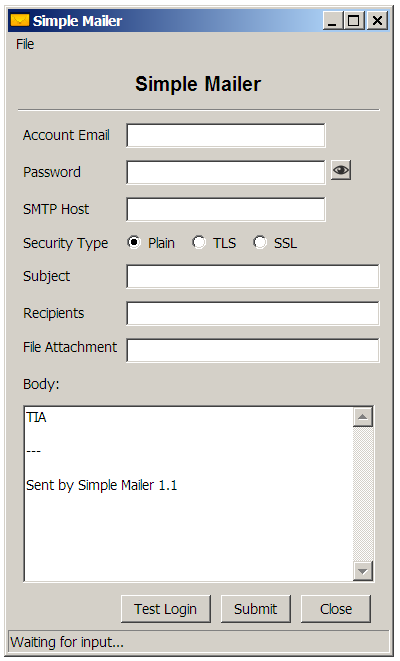
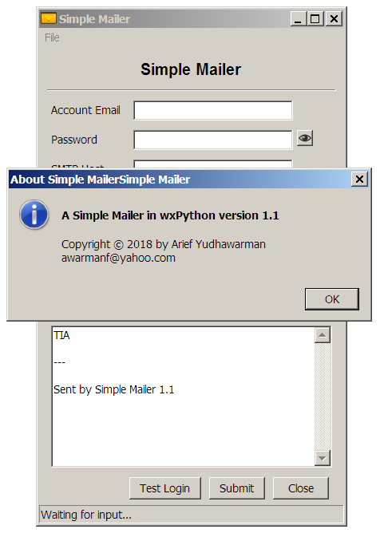
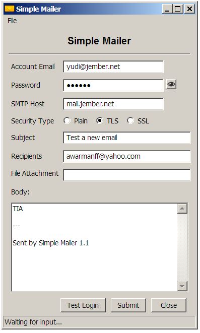
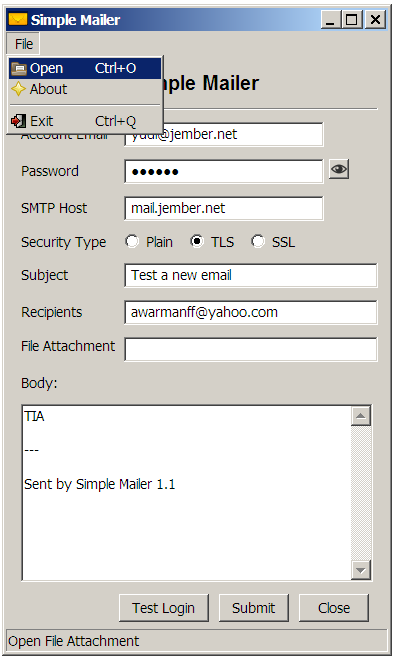
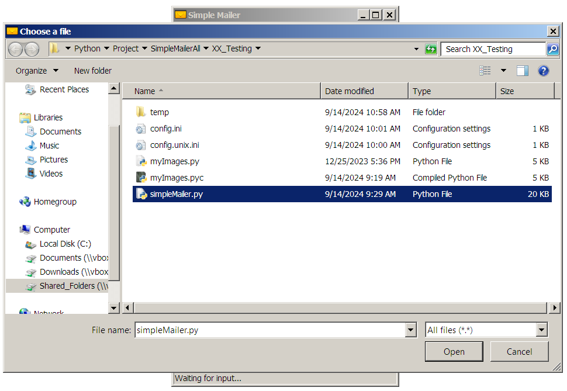
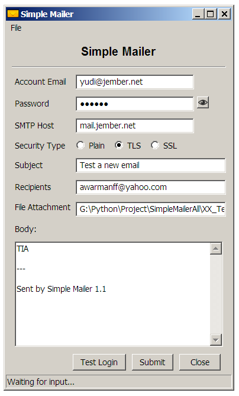

# Simple Mailer - 3

## Features

- Test without sending a message
  - Authentication or login test
  - Recipient Address Check
  - Sender Check
- PLAIN without authentication using port 25
- PLAIN with authentication using port 587
- TLS using port 587
- SSL using port 465
- Add menu
  - Open, to open file for file attachment
  - About, to show the author and copy rights
  - Exit, to close the Application
- All Icon images are saved on file *myImages.py* not as a static image
  - Icon for menu item (Open, About, Exit)
  - Icon viewer password
  - Icon email
- Add tooltip on *self.txtRcpts* widget
- Version 1.1

Include all features from the previuos stage.

## Download Win32 Application

[simpleMailer_1.1.exe](http://jember.net/files/simpleMailer_1.1.exe)

## Screenshots

### Sent Email with File Attachment














### Send Email Test

#### Authentication or Login Test


After filling some required entries then click *Test Login* button.

#### Sender Check Test


After filling some required entries then click *Submit* button.

Some 5.7.1 errors

```
- 5.7.1 <unknown[1.2.3.4]>: Client host rejected: Access denied
  The ip sender is rejected to sent email
  
- 5.7.1 <arief@domain.org>: Sender Address rejected: Access denied
  The sender <arief@domain.org> is rejected to sent email

- 5.7.1 <mailing-list@domain.org>: Recipient Address rejected: Access denied
  You are not allowed to sent email to mailing list
```

#### Recipient Check Test


After filling some required entries then click *Submit* button.


Got an error if the recipient was not found or not exist.


