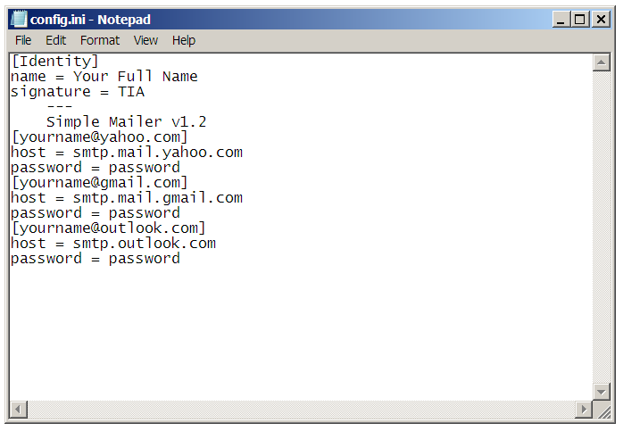
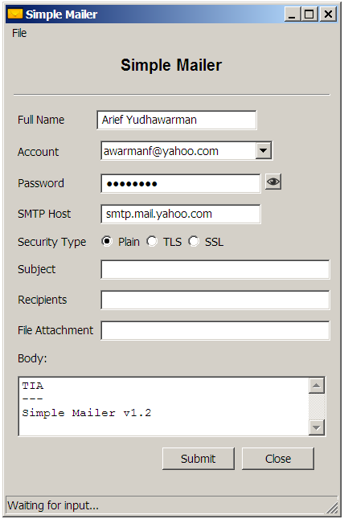
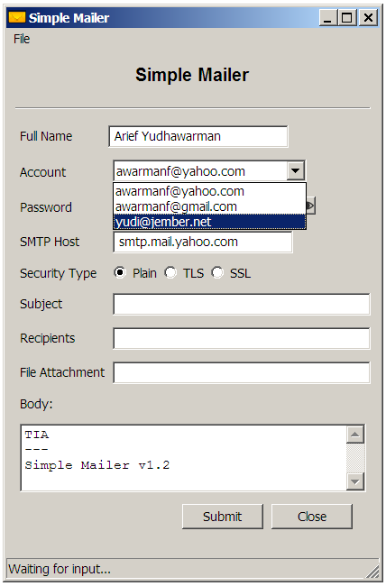
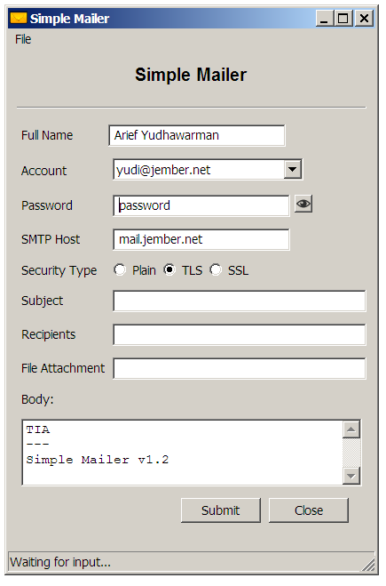
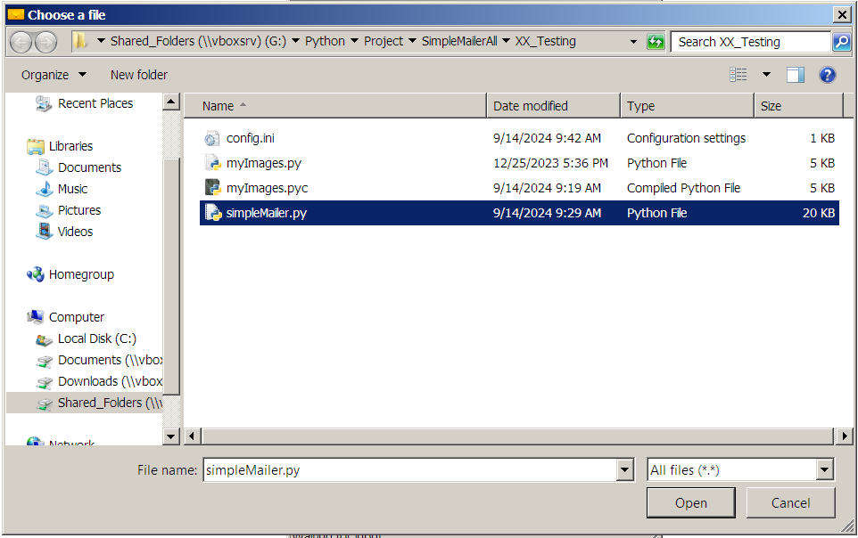
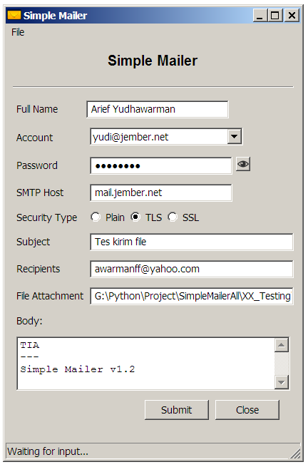
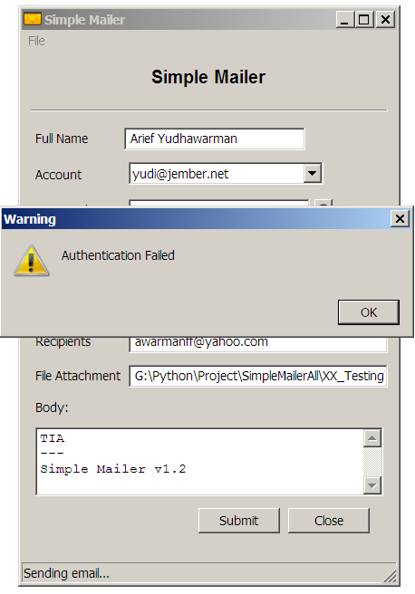

# Simple Mailer - 4

## Features

- Use file config.ini to save the accounts
  - Signature
  - Email address
  - Password
  - SMTP Host
- Use control on menu combobox to select the account
- Support file attachment
- Version 1.2

Include all features from the previuos stage.

## File config.ini

You must create a file _config.ini_ using a text editor before using the application.

```config
[Identity]
name = Your Full Name
signature = TIA
    ---
    Simple Mailer v1.2
[yourname@yahoo.com]
host = smtp.mail.yahoo.com
password = password
[yourname@gmail.com]
host = smtp.mail.gmail.com
password = password
[yourname@outlook.com]
host = smtp.outlook.com
password = password
```



The _config.ini_ is a clear text or not encrypted. So you must keep the file in secret.

>File _config.ini_ is OS dependent. The application support DOS/Mac and Unix text file format.

## Download Win32 Application

Include file `config.ini`.

[simpleMailer_1.2.zip](http://jember.net/files/simpleMailer_1.2.zip)

## Screenshots

### Select Account







This is not a real password :D.

### Attaching File





### Send Email



As predicted the authentication is failed.


