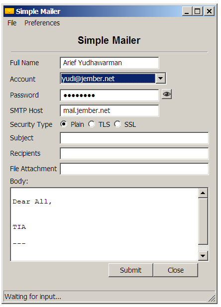
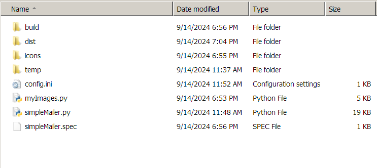
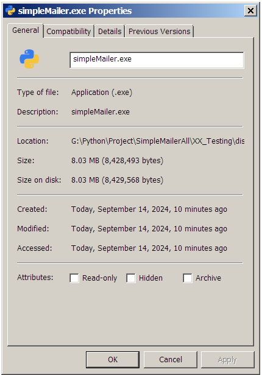
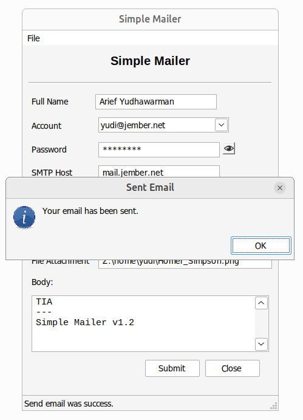

# Simple Mailer

Simple Mailer is a GUI Application written in python and wxpython as GUI toolkit. It's like a mailer program or simple smtp client that can be used 
not only to send emails with file attachment but also to do some jobs:

- Authentication test
- Recipient Address Check
- Sender Check

It supports SASL and TLS security and of coure some regex to check the validity of the email address. Another 
thing it has an encrypted config file which containts your signature and your email accounts. So you don't need 
memorize all email passwords only need one masterkey to read the config.

Python version: 2.7

This is the looking of the final application (click on the image below to show the youtube video).

Personally this is my first GUI programming with wxpython. I am prefer wxpython than tkinter due to native look-and-feel :).

## Installing wxpython

You should use python 2.7 and install some dependencies in order wxpython to work.

Debian or Ubuntu.

    apt-get install python-wxglade pyqt4-dev-tools python-qt4-doc

Windows which has already installed python2.7.

    pip install -U wxPython

## About Application

The application name is _simpleMailer.py_. You can execute it by entering command

    python simpleMailer.py

## Icon Images

Images such as email icon, exit menu icon, etc are embedded into script `myImages.py` using script 
`img2py.py` (Linux) or application `img2py` (Windows).

For Linux

    python /usr/lib/python2.7/dist-packages/wx-3.0-gtk2/wx/tools/img2py.py -i icons/email-icon.png myImages.py

For Windows, first make sure Python27 already in PATH 

    PATH=C:\Windows\system32;C:\Windows;...;C:\Python27;C:\Python27\Scripts
    img2py -i icons\email-icon.png myImages.py

For adding a new icon in Linux

    python /usr/lib/python2.7/dist-packages/wx-3.0-gtk2/wx/tools/img2py.py -ai icons/exit-item.png myImages.py

Or in Windows

    img2py -ai icons\exit-item.png myImages.py

All icons are downloaded from this site

[Icon Archive](https://www.iconarchive.com)

## Compiling Python Script to Win32 Application (Windows)

Install pyinstaller using pip

    pip install pyinstaller

Then create one file application exe with an icon `python-icon.ico`

    pyinstaller -F -w -i python-icon.ico simpleMailer.py

If the compilation is success it will create some directories

Go to dist directory. The stand alone application will have a name `simpleMailer.exe` and an icon.

You can execute this application on Linux too using wine ;).

This executed on Ubuntu 22.04.

## Stages

I'm developing this GUI Application from the very start until the final stages. From the easiest 
stage to the most difficult one.

### Stage 1

This is my first application. It's very simple. Email is sent by unsecure link. This email is not encrypted, its 
contents are transmitted as plain, readable text. This leaves the information vulnerable to interception 
by malicious actors, such as hackers or even your internet service provide. Test the application only on
your LAN.

There's a method to check all entries must be filled before send the email or pressing the OK button.

[Stage One](https://github.com/awarmanf/simple_mailer_gui/tree/master/1_Stage_One)

### Stage 2

Add features

- Regex to check the email validity
- An icon which shown at the top left of the application
- Version 1.0

[Stage Two](https://github.com/awarmanf/simple_mailer_gui/tree/master/2_Stage_Two)

### Stage 3

Add features

- Authentication test
- Recipient Address Check
- Sender Check
- PLAIN without authentication using port 25
- PLAIN with authentication using port 587
- TLS using port 587
- SSL using port 465
- Version 1.1

[Stage Three](https://github.com/awarmanf/simple_mailer_gui/tree/master/3_Stage_Three)

### Stage 4

Add features

- Use file config.ini to save the accounts
  - Signature
  - Email address
  - Password
  - SMTP Host
- Use control on menu combobox to select the account
- Support file attachment
- Version 1.2

[Stage Four](https://github.com/awarmanf/simple_mailer_gui/tree/master/4_Stage_Four)

### Stage 5

Under development.

### Stage 6

Under development.

